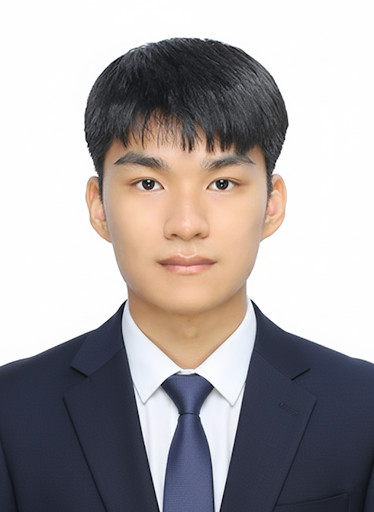
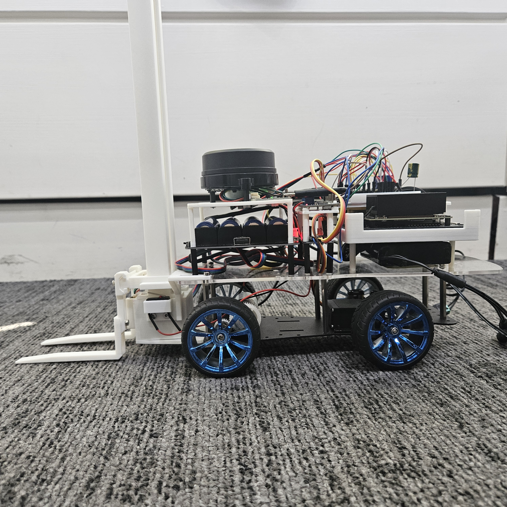
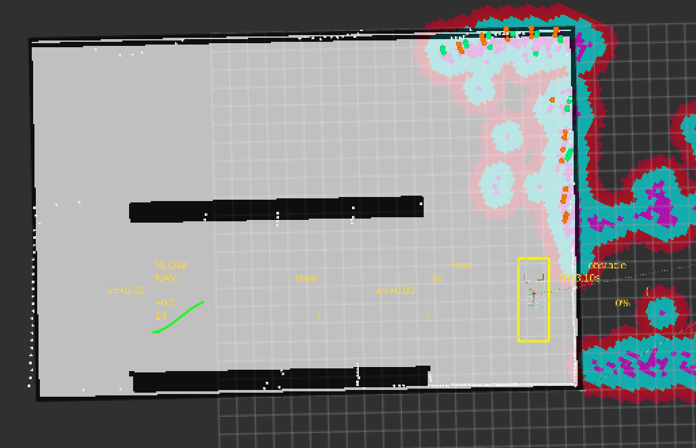
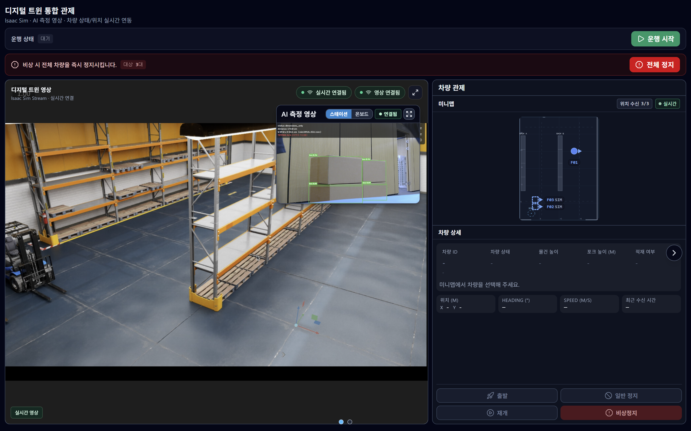
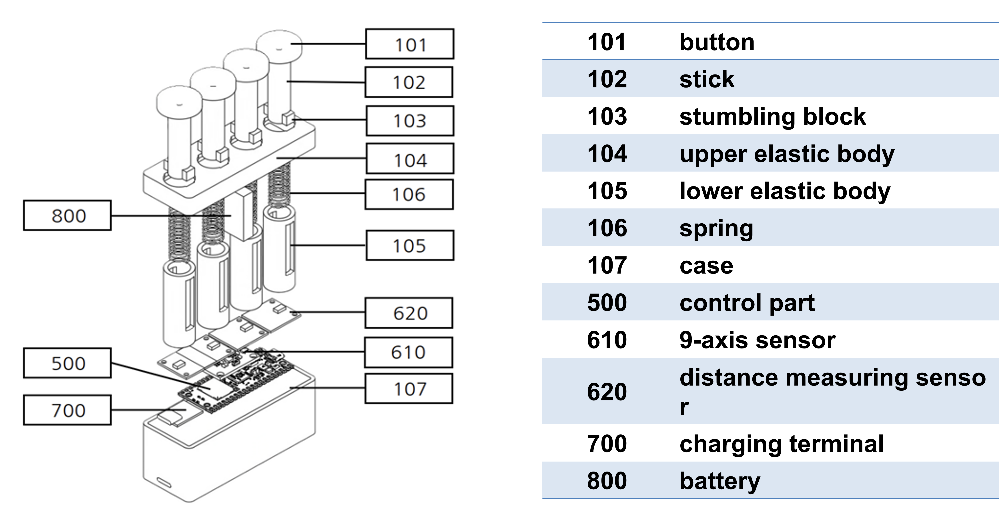
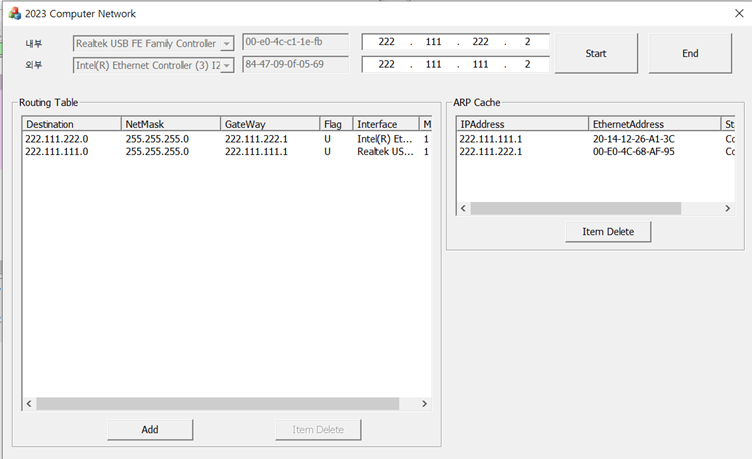
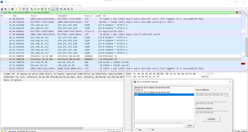
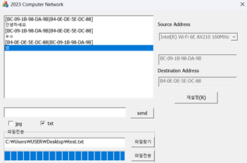
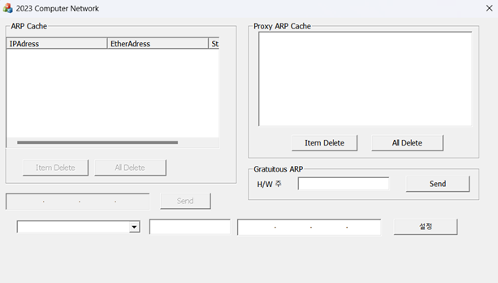
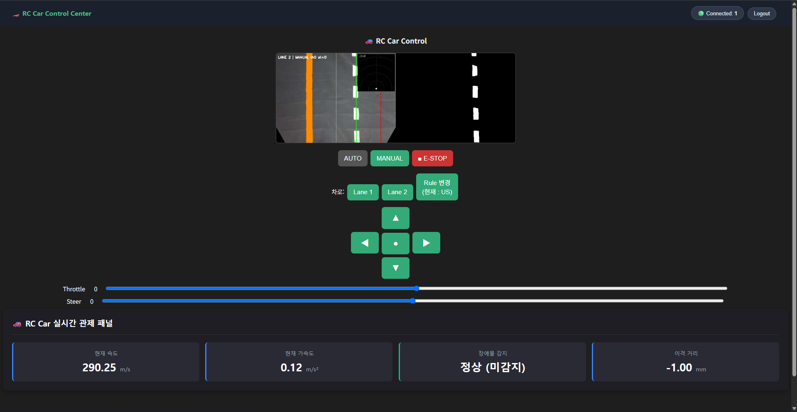

<title>안제원 — 임베디드 SW 엔지니어</title>
<link rel="preconnect" href="https://fonts.googleapis.com">
<link rel="preconnect" href="https://fonts.gstatic.com" crossorigin>
<link href="https://fonts.googleapis.com/css2?family=Noto+Sans+KR:wght@400;500;700;900&display=swap" rel="stylesheet">

  <!-- HEADER -->
  <header class="header">
    
    

      <h1>안제원</h1>
      
임베디드 SW 엔지니어

      
센서 인터페이스와 시리얼 통신을 주로 다루고 있습니다. SSAFY에서 자율주행 물류 로봇을 만들었고, 학부에서는 C++로 ARP/IP 계층과 소프트웨어 라우터를 구현했습니다.

      

        inno505@naver.com
        <a href="https://github.com/AhnJewon" target="_blank">github.com/AhnJewon</a>
      

    

  </header>

  <!-- SKILLS -->
  <section class="section">
    
Skills

    

      
Languages

      

        C++
        C
        Python
        MicroPython
        Java
        Dart
      

      
Embedded

      

        ROS2 Humble
        ESP32-S3
        Jetson Orin Nano
        Raspberry Pi Pico W
        FreeRTOS
      

      
Protocols

      

        UART
        I2C
        BLE
        MQTT
        TCP/IP
        DDS
      

      
Control

      

        PID / 폐루프 제어
        EKF 센서 융합
        Nav2 / SLAM
      

      
Tools

      

        Git
        Docker
        Linux
        Jira
      

    

  </section>

  <!-- PROJECTS -->
  <section class="section">
    
Projects

    <!-- ===== F.A.S.T. ===== -->
    

      

        F.A.S.T.
        2026.07 – 08 · 6인 팀 · SSAFY 우수상
      

      
1/10 스케일 무인 지게차. 2×3m 환경에서 자율주행 후 파렛트에 포크를 정밀 적재하는 디지털 트윈 물류 시스템.

      
자율주행 파트 리더 — 센서 융합 · SLAM · Nav2 · 통신 설계 · 포크 기구

      
ROS2 Humble · Nav2 · slam_toolbox · C++ · Python · Jetson Orin Nano · ESP32-S3 · UART · MQTT

      

      

        <figure>
          
          <figcaption>RViz — SLAM 맵 + costmap 레이어 + Nav2 경로</figcaption>
        </figure>
        <figure>
          
          <figcaption>디지털 트윈 통합 관제 화면 (Isaac Sim 연동)</figcaption>
        </figure>
      

      

        

          
37% → 4%

          
모터 속도 오차 (적분 전용 폐루프 제어)

        

        

          
109 → 4

          
/dev/shm 세그먼트 (UDPv4 루프백 전환)

        

        

          
0%

          
DDS 통신 오류율 (반복 재기동 검증)

        

      

      <!-- Architecture -->
      

        <svg viewBox="0 0 720 340" xmlns="http://www.w3.org/2000/svg" style="font-family:var(--font),sans-serif;">
          <rect x="10" y="8" width="700" height="80" rx="6" fill="none" stroke="var(--c-diagram-sensor)" stroke-width="1.5" stroke-dasharray="4 2" opacity="0.5"/>
          <text x="24" y="26" font-size="10" font-weight="700" fill="var(--c-diagram-sensor)" opacity="0.7">PERCEPTION</text>
          <rect x="30" y="36" width="100" height="40" rx="5" fill="var(--c-diagram-sensor)"/><text x="80" y="61" text-anchor="middle" font-size="12" font-weight="600" fill="#fff">LiDAR</text>
          <rect x="150" y="36" width="100" height="40" rx="5" fill="var(--c-diagram-sensor)"/><text x="200" y="61" text-anchor="middle" font-size="12" font-weight="600" fill="#fff">ToF</text>
          <rect x="270" y="36" width="100" height="40" rx="5" fill="var(--c-diagram-sensor)"/><text x="320" y="61" text-anchor="middle" font-size="12" font-weight="600" fill="#fff">IMU</text>
          <rect x="390" y="36" width="100" height="40" rx="5" fill="var(--c-diagram-sensor)"/><text x="440" y="61" text-anchor="middle" font-size="12" font-weight="600" fill="#fff">Encoder</text>
          <rect x="540" y="36" width="150" height="40" rx="5" fill="var(--c-diagram-proc)"/><text x="615" y="58" text-anchor="middle" font-size="11" font-weight="600" fill="#fff">EKF 센서 융합</text>
          <line x1="130" y1="56" x2="540" y2="56" stroke="var(--c-diagram-arrow)" stroke-width="1" opacity="0.3"/>
          <path d="M490 56 L535 56" stroke="var(--c-diagram-arrow)" stroke-width="1.5" marker-end="url(#arrowG)"/>
          <rect x="10" y="104" width="700" height="80" rx="6" fill="none" stroke="var(--c-diagram-proc)" stroke-width="1.5" stroke-dasharray="4 2" opacity="0.5"/>
          <text x="24" y="122" font-size="10" font-weight="700" fill="var(--c-diagram-proc)" opacity="0.7">NAVIGATION</text>
          <rect x="30" y="132" width="140" height="40" rx="5" fill="var(--c-diagram-proc)"/><text x="100" y="155" text-anchor="middle" font-size="11" font-weight="600" fill="#fff">SLAM Toolbox</text>
          <rect x="210" y="132" width="200" height="40" rx="5" fill="var(--c-diagram-proc)"/><text x="310" y="155" text-anchor="middle" font-size="11" font-weight="600" fill="#fff">Nav2 + Behavior Tree</text>
          <rect x="450" y="132" width="160" height="40" rx="5" fill="var(--c-diagram-proc)"/><text x="530" y="149" text-anchor="middle" font-size="11" font-weight="600" fill="#fff">Drive Mux</text><text x="530" y="163" text-anchor="middle" font-size="10" fill="#cce0ff">I-Controller</text>
          <path d="M170 152 L205 152" stroke="var(--c-diagram-arrow)" stroke-width="1.5" marker-end="url(#arrowG)"/>
          <path d="M410 152 L445 152" stroke="var(--c-diagram-arrow)" stroke-width="1.5" marker-end="url(#arrowG)"/>
          <path d="M615 76 L615 100 L530 100 L530 128" stroke="var(--c-diagram-arrow)" stroke-width="1.5" marker-end="url(#arrowG)"/>
          <rect x="10" y="200" width="700" height="130" rx="6" fill="none" stroke="var(--c-diagram-hw)" stroke-width="1.5" stroke-dasharray="4 2" opacity="0.5"/>
          <text x="24" y="218" font-size="10" font-weight="700" fill="var(--c-diagram-hw)" opacity="0.7">HARDWARE</text>
          <rect x="30" y="235" width="200" height="55" rx="5" fill="var(--c-diagram-hw)"/><text x="130" y="258" text-anchor="middle" font-size="12" font-weight="600" fill="#fff">Jetson Orin Nano</text><text x="130" y="275" text-anchor="middle" font-size="10" fill="#d4bfff">ROS2 · DDS UDPv4</text>
          <rect x="270" y="250" width="100" height="28" rx="4" fill="var(--c-diagram-comm)"/><text x="320" y="268" text-anchor="middle" font-size="10" font-weight="700" fill="#fff">UART CRC-16</text>
          <path d="M230 263 L265 263" stroke="var(--c-diagram-comm)" stroke-width="2" marker-end="url(#arrowO)"/>
          <path d="M370 263 L405 263" stroke="var(--c-diagram-comm)" stroke-width="2" marker-end="url(#arrowO)"/>
          <rect x="410" y="235" width="160" height="55" rx="5" fill="var(--c-diagram-hw)"/><text x="490" y="258" text-anchor="middle" font-size="12" font-weight="600" fill="#fff">ESP32-S3</text><text x="490" y="275" text-anchor="middle" font-size="10" fill="#d4bfff">FreeRTOS</text>
          <rect x="610" y="245" width="80" height="36" rx="5" fill="var(--c-diagram-hw)" opacity="0.7"/><text x="650" y="268" text-anchor="middle" font-size="11" font-weight="600" fill="#fff">Motors</text>
          <path d="M570 263 L605 263" stroke="var(--c-diagram-arrow)" stroke-width="1.5" marker-end="url(#arrowG)"/>
          <path d="M530 172 L530 192 L130 192 L130 231" stroke="var(--c-diagram-arrow)" stroke-width="1.5" marker-end="url(#arrowG)"/>
          <defs>
            <marker id="arrowG" markerWidth="8" markerHeight="6" refX="7" refY="3" orient="auto"><path d="M0,0 L8,3 L0,6" fill="var(--c-diagram-arrow)"/></marker>
            <marker id="arrowO" markerWidth="8" markerHeight="6" refX="7" refY="3" orient="auto"><path d="M0,0 L8,3 L0,6" fill="var(--c-diagram-comm)"/></marker>
          </defs>
        </svg>
      

      
내가 한 것

      <ul class="fact-list">
        <li><strong>uart_teleop_bridge / sensor_bridge 노드 구축</strong> — ESP32에서 수신되는 바이트 스트림을 CRC-16으로 검증하고, 정상 패킷을 /imu/data, /wheel/twist 토픽으로 파싱·발행</li>
        <li><strong>적분(I) 전용 폐루프 속도 제어기</strong> — 저속 구간에서 정지마찰을 못 넘는 P 제어 한계 확인 후, I 단독으로 전환. 듀티 축적이 마찰력을 자율 돌파하도록 설계</li>
        <li><strong>EKF 센서 융합</strong> — LiDAR, ToF, IMU, 엔코더 4종의 공분산 가중치를 실험적으로 조정</li>
        <li><strong>Nav2 Behavior Tree + costmap 9단계 튜닝</strong> — 동적 장애물 잔상 문제를 voxel layer 수집 주기 조정으로 해결</li>
        <li><strong>Maximum 병합 기반 센서 레이어 분리</strong> — ToF clearing이 LiDAR 장애물을 덮어쓰는 문제를 costmap 결합 수식 분석 후 레이어 격리</li>
        <li><strong>forklift_teleop 패키지</strong> — 20개 노드/모듈 + 12개 테스트 파일 직접 작성</li>
      </ul>

      

        
트러블슈팅 — DDS 통신 단절 원인 추적

        
데모 3일 전, 액션 응답 유실 + TF 끊김이 간헐 발생. "보드 재부팅"이라는 임시 대응을 거부하고 원인을 추적:

        <ol>
          <li>상위 노드 로그 → 토픽 구독 자체가 누락되는 것 확인</li>
          <li>/dev/shm 확인 → 비정상 종료 후 세마포어 파일 잔여 발견</li>
          <li>정상 종료 vs 강제 종료 비교 → 강제 종료 시 잠금 파일 미해제 확인</li>
          <li>찌꺼기 수동 삭제 → 일시 복구되나 재발. 대증요법 한계</li>
          <li>단일 보드 내 통신 비중 분석 → 공유메모리가 불필요한 구간이 대부분</li>
          <li>fastdds_no_shm.xml 프로파일 작성, UDPv4 로컬 루프백 전환</li>
          <li>결과: /dev/shm 세그먼트 109 → 4, 통신 오류 0%</li>
        </ol>
      

    

    <!-- ===== Power Up ===== -->
    

      

        Power Up — 재활 악력 컨트롤러
        2024 · 4인 팀 · CEDC 국제 경진대회 은상
      

      
편마비 환자가 스프링 버튼을 눌러 악력을 훈련하고, 손목 기울기로 조작하는 악력기형 IoT 게임 컨트롤러. Unity 재활 미니게임과 BLE 실시간 연동.

      
임베디드 펌웨어 — 하드웨어 전체 + BLE

      
MicroPython · Raspberry Pi Pico W · I2C · VL6180X ×4 (ToF) · MPU9250 (9축 IMU) · BLE

      

      

        

          
0x29 → 개별

          
I2C 주소 충돌 해결 (GPIO 순차 전원 + 레지스터 재할당)

        

        

          
23 → 150 B

          
BLE MTU 확장 (패킷 유실률 0%)

        

        

          
100-sample

          
지자기 캘리브레이션 (하드/소프트 아이언 보정)

        

      

      <!-- Power Up Diagram -->
      

        <svg viewBox="0 0 680 200" xmlns="http://www.w3.org/2000/svg" style="font-family:var(--font),sans-serif;">
          <rect x="10" y="20" width="120" height="36" rx="5" fill="var(--c-diagram-sensor)"/><text x="70" y="43" text-anchor="middle" font-size="11" font-weight="600" fill="#fff">ToF × 4 (I2C)</text>
          <rect x="10" y="70" width="120" height="36" rx="5" fill="var(--c-diagram-sensor)"/><text x="70" y="93" text-anchor="middle" font-size="11" font-weight="600" fill="#fff">IMU 9축</text>
          <rect x="10" y="120" width="120" height="36" rx="5" fill="var(--c-diagram-sensor)"/><text x="70" y="143" text-anchor="middle" font-size="11" font-weight="600" fill="#fff">스프링 버튼 ×4</text>
          <rect x="200" y="30" width="180" height="130" rx="8" fill="var(--c-diagram-hw)"/>
          <text x="290" y="58" text-anchor="middle" font-size="13" font-weight="700" fill="#fff">Pico W</text>
          <text x="290" y="80" text-anchor="middle" font-size="10" fill="#d4bfff">GPIO 순차 전원 제어</text>
          <text x="290" y="96" text-anchor="middle" font-size="10" fill="#d4bfff">I2C 주소 런타임 재할당</text>
          <text x="290" y="112" text-anchor="middle" font-size="10" fill="#d4bfff">지자기 캘리브레이션</text>
          <text x="290" y="128" text-anchor="middle" font-size="10" fill="#d4bfff">Low-pass 필터</text>
          <text x="290" y="148" text-anchor="middle" font-size="10" fill="#d4bfff">JSON 직렬화</text>
          <path d="M130 38 L195 60" stroke="var(--c-diagram-arrow)" stroke-width="1.5" marker-end="url(#arrowG)"/>
          <path d="M130 88 L195 95" stroke="var(--c-diagram-arrow)" stroke-width="1.5" marker-end="url(#arrowG)"/>
          <path d="M130 138 L195 130" stroke="var(--c-diagram-arrow)" stroke-width="1.5" marker-end="url(#arrowG)"/>
          <rect x="430" y="65" width="90" height="60" rx="5" fill="var(--c-diagram-comm)"/><text x="475" y="91" text-anchor="middle" font-size="12" font-weight="700" fill="#fff">BLE</text><text x="475" y="107" text-anchor="middle" font-size="10" fill="#fff">MTU 150</text>
          <path d="M380 95 L425 95" stroke="var(--c-diagram-comm)" stroke-width="2" marker-end="url(#arrowO)"/>
          <rect x="570" y="65" width="100" height="60" rx="5" fill="var(--c-diagram-proc)"/><text x="620" y="91" text-anchor="middle" font-size="12" font-weight="600" fill="#fff">Unity</text><text x="620" y="107" text-anchor="middle" font-size="10" fill="#cce0ff">재활 미니게임</text>
          <path d="M520 95 L565 95" stroke="var(--c-diagram-arrow)" stroke-width="1.5" marker-end="url(#arrowG)"/>
        </svg>
      

      
내가 한 것

      <ul class="fact-list">
        <li><strong>I2C 주소 충돌 우회</strong> — VL6180X 4개가 동일 주소 0x29. 물리 점퍼 공간 없어서 GPIO 순차 전원 인가 후 레지스터에서 주소를 런타임 재할당</li>
        <li><strong>BLE MTU 확장</strong> — JSON 센서 데이터가 23바이트 기본 MTU에서 잘림. ble_simple_peripheral.py 내부에서 self._ble.config(mtu=150) 협상으로 해결</li>
        <li><strong>지자기 캘리브레이션</strong> — 사무실 철제 프레임의 하드/소프트 아이언 왜곡으로 방위각이 엉망. 부팅 시 100회 샘플로 자기장 구 중심 바이어스를 영점 보정</li>
      </ul>
    

    <!-- ===== MFC Router ===== -->
    

      

        네트워크 프로토콜 스택 & 소프트웨어 라우터
        2023 · 개인 · 컴퓨터네트워크 A+
      

      
컴퓨터네트워크 수업에서 C++ MFC로 Ethernet·IP·ARP 계층을 구현하고, 실제 패킷을 라우팅하는 채팅 프로그램 제작.

      
1인 전체 설계 및 구현

      
C++ · MFC Framework · WinPcap/Npcap API · Multithreading

      

        <figure>
          
          <figcaption>Static Routing Table + ARP Cache (실제 NIC 바인딩)</figcaption>
        </figure>
        <figure>
          
          <figcaption>Wireshark 송신 캡처 — Npcap으로 실제 이더넷 프레임 전송</figcaption>
        </figure>
        <figure>
          
          <figcaption>프로토콜 스택 위에 구축한 채팅 + 파일 전송</figcaption>
        </figure>
        <figure>
          
          <figcaption>ARP Cache / Proxy ARP / Gratuitous ARP 구현</figcaption>
        </figure>
      

      <!-- MFC Diagram -->
      

        <svg viewBox="0 0 680 190" xmlns="http://www.w3.org/2000/svg" style="font-family:var(--font),sans-serif;">
          <rect x="160" y="10" width="200" height="36" rx="5" fill="var(--c-diagram-proc)"/><text x="260" y="33" text-anchor="middle" font-size="12" font-weight="600" fill="#fff">Application (Chat/Dialog)</text>
          <path d="M260 46 L260 54" stroke="var(--c-diagram-arrow)" stroke-width="1.5" marker-end="url(#arrowG)"/>
          <rect x="160" y="56" width="200" height="36" rx="5" fill="var(--c-diagram-proc)"/><text x="260" y="79" text-anchor="middle" font-size="12" font-weight="600" fill="#fff">CARPLayer</text>
          <path d="M260 92 L260 100" stroke="var(--c-diagram-arrow)" stroke-width="1.5" marker-end="url(#arrowG)"/>
          <rect x="160" y="102" width="200" height="36" rx="5" fill="var(--c-diagram-proc)"/><text x="260" y="125" text-anchor="middle" font-size="12" font-weight="600" fill="#fff">CIPLayer</text>
          <path d="M260 138 L260 146" stroke="var(--c-diagram-arrow)" stroke-width="1.5" marker-end="url(#arrowG)"/>
          <rect x="160" y="148" width="200" height="36" rx="5" fill="var(--c-diagram-hw)"/><text x="260" y="171" text-anchor="middle" font-size="12" font-weight="600" fill="#fff">CEthernetLayer → CNILayer</text>
          <rect x="30" y="56" width="110" height="82" rx="5" fill="none" stroke="var(--c-diagram-sensor)" stroke-width="1.5" stroke-dasharray="4 2"/>
          <text x="85" y="80" text-anchor="middle" font-size="10" font-weight="600" fill="var(--c-diagram-sensor)">CBaseLayer</text>
          <text x="85" y="95" text-anchor="middle" font-size="9" fill="var(--c-text3)">추상 인터페이스</text>
          <text x="85" y="110" text-anchor="middle" font-size="9" fill="var(--c-text3)">다형성 상속</text>
          <text x="85" y="125" text-anchor="middle" font-size="9" fill="var(--c-text3)">계층 디커플링</text>
          <rect x="400" y="56" width="130" height="82" rx="5" fill="var(--c-diagram-comm)"/>
          <text x="465" y="80" text-anchor="middle" font-size="11" font-weight="700" fill="#fff">CLayerManager</text>
          <text x="465" y="98" text-anchor="middle" font-size="9" fill="#fff">계층 링킹</text>
          <text x="465" y="112" text-anchor="middle" font-size="9" fill="#fff">문자열 파싱</text>
          <text x="465" y="126" text-anchor="middle" font-size="9" fill="#fff">동적 배선</text>
          <path d="M400 97 L365 97" stroke="var(--c-diagram-comm)" stroke-width="1.5" marker-end="url(#arrowO)"/>
          <rect x="550" y="148" width="120" height="36" rx="5" fill="var(--c-diagram-sensor)" opacity="0.8"/><text x="610" y="167" text-anchor="middle" font-size="10" font-weight="600" fill="#fff">Npcap (비동기)</text><text x="610" y="179" text-anchor="middle" font-size="9" fill="#fff">CWinThread</text>
          <path d="M360 166 L545 166" stroke="var(--c-diagram-arrow)" stroke-width="1.5" marker-end="url(#arrowG)"/>
        </svg>
      

      
내가 한 것

      <ul class="fact-list">
        <li><strong>CBaseLayer 추상 인터페이스</strong> — 모든 계층이 상속. 한 계층을 수정해도 인접 계층이 깨지지 않는 디커플링</li>
        <li><strong>CLayerManager</strong> — 문자열 파싱으로 계층 인스턴스를 탐색·배선. 텍스트 설정만으로 스택 구조 변경 가능</li>
        <li><strong>Npcap 비동기 수신</strong> — 소켓 수신 무한 루프가 MFC UI를 먹통으로 만드는 문제. CWinThread 분리 + PostMessage 이벤트 핸들링으로 해결</li>
        <li><strong>ARP Cache + Routing Table</strong> — 동적 캐시 생성/만료/삭제, Proxy ARP, Gratuitous ARP 구현</li>
      </ul>
    

    <!-- ===== RC Car ===== -->
    

      

        RC카 자율주행 라인 트레이싱
        2023 · 개인 · 학부 임베디드 융합 제어
      

      
카메라 차선 인식 + 1D LiDAR/초음파 장애물 감지 + PID 속도 제어로 라인을 따라 자율주행하는 RC카. MQTT 텔레메트리 실시간 관제.

      
1인 전체 설계 및 구현

      
Python · C++ · Arduino · OpenCV (허프 변환) · PID Control · MQTT · Raspberry Pi · PCA9685

      

      
내가 한 것

      <ul class="fact-list">
        <li><strong>웹 관제 UI</strong> — 카메라 실시간 피드 + AUTO/MANUAL/E-STOP 모드 전환 + Throttle·Steer 슬라이더 + 속도/가속도/장애물/이격거리 대시보드</li>
        <li><strong>OpenCV 차선 검출 파이프라인</strong> — 소벨 필터 + 허프 변환으로 차선 이탈량 도출. 30Hz 실시간 처리</li>
        <li><strong>PID 조향·감속 제어</strong> — 급커브에서 원심력 탈선 방지. 조향각 편차의 I/D 값을 모터 속도에 피드백하여 능동 감속</li>
        <li><strong>센서 스레드 격리</strong> — LiDAR/IMU 시리얼 폴링을 백그라운드 데몬 스레드로 분리. Lock 동기화로 비전 루프 지연 방지</li>
        <li><strong>MQTT 텔레메트리</strong> — 속도/LiDAR 거리/배터리/에러 상태를 JSON으로 초당 15회 실시간 전송</li>
        <li><strong>장애물 우회</strong> — LiDAR 전방 30cm 이내 감지 시 차선 변경 또는 급제동 안전 로직</li>
      </ul>
    

  </section>

  <!-- OTHER PROJECTS -->
  <section class="section">
    
Other Projects

    

      

        <h4>세렌디피티 검색 엔진</h4>
        
124만 위키백과 벡터 DB에서 의미적 대척점을 계산. Gap-Filling 재귀 평탄화 알고리즘.

        
2025–2026 · 1인 개발 · Python, Ko-SBERT, Wikidata

      

      

        <h4>오공파 — 미세먼지 모니터링</h4>
        
Arduino BLE 센서 + Android 대시보드. Naver Maps 좌표 동기화.

        
2022 · 개인 · Java, Android SDK, BLE

      

    

  </section>

  <!-- EDUCATION -->
  <section class="section">
    
Education & Certifications

    

      <h4>충북대학교 · 컴퓨터공학과</h4>
      
2020.03 – 2026.02 · 공학학사

      
학점 4.08/4.50 · 전공 석차 3/50 · 운영체제(A+) · 컴퓨터구조(A+) · 네트워크(A+) · 알고리즘(A+)

    

    

      <h4>삼성 청년 SW 아카데미(SSAFY) 15기 · 임베디드 트랙</h4>
      
2026 · 925시간 · 2학기 공통 프로젝트 우수상

    

    

      
<strong>정보처리기사</strong> 2025.09

      
<strong>OPIc English IH</strong>

    

  </section>

  <footer class="footer">
    안제원 · inno505@naver.com · github.com/AhnJewon
  </footer>

